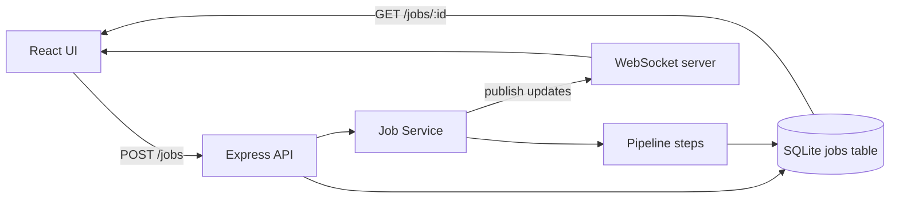

# Fullstack Job Processing Demo

Small fullstack demo with:

- `frontend`: React + Vite + TypeScript
- `backend`: Node + Express + WebSocket + SQLite via built-in `node:sqlite`

## User Scenarios

1. A user selects a goal, enters a positive numeric value, and starts processing with WebSocket.
   The backend creates a job in SQLite with `queued` status, starts the pipeline, and pushes live status/progress updates for that exact `jobId` over WebSocket until the result is ready.

2. A user selects the same inputs but starts processing with HTTP polling.
   The backend creates a job, the frontend shows an indeterminate progress bar, and periodically requests `GET /jobs/:id` until the job reaches `done` or `failed`, then displays the mock result.

## Job Processing

Each job is persisted in SQLite and goes through these states:

`queued -> processing -> done | failed`

Processing is implemented as an extensible pipeline of separate step modules:

1. `analyzeSelectionStep`
2. `calculateRecommendationStep`
3. `finalizeResultStep`

Each step simulates work with `setTimeout`-based delay, updates progress, and contributes part of the final mock result.

## Status Updates

- `WebSocket`: the client connects to `/ws?jobId=<id>`, and the server sends real-time updates for that specific job only.
- `HTTP`: the client calls `GET /jobs/:id` on an interval and renders an indeterminate progress bar until the backend returns `done` or `failed`.

## High-Level Flow



## Architecture Notes

- API routes are in `backend/src/index.ts`
- Job persistence is isolated in `backend/src/jobs/jobRepository.ts`
- Job orchestration is in `backend/src/jobs/jobService.ts`
- Pipeline logic is separated into `backend/src/pipeline/*`
- Frontend networking is isolated in `frontend/src/api.ts`
- UI state and step flow live in `frontend/src/App.tsx`

This keeps API, job logic, and pipeline separate instead of putting everything into one file.

## API

### `POST /jobs`

Creates a new job.

Request body:

```json
{
  "selection": "Lose weight",
  "inputValue": 56
}
```

### `GET /jobs/:id`

Returns the latest persisted job state from SQLite.

## Local Run

Install dependencies:

```bash
npm install
```

Run backend:

```bash
npm run dev:backend
```

Run frontend:

```bash
npm run dev:frontend
```

Frontend defaults:

- UI: `http://localhost:5173`
- API: `http://localhost:3001`
- WebSocket: `ws://localhost:3001/ws`

Optional frontend env:

```bash
cp frontend/.env.example frontend/.env
```

## Validation

- `npm run lint`
- `npm run build`

## Deployment Notes

The repo is ready for deployment, but live GitHub/deployment links are not included here because they depend on your own repository and hosting credentials.

Suggested targets:

- Frontend: Firebase Hosting
- Backend: Render / Railway / Fly.io / any Node host
